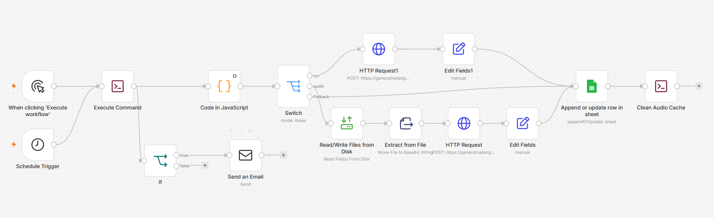
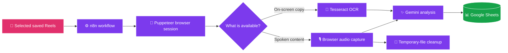

<p align="center">
  
</p>

<h1 align="center">🎬 Instagram Reels AI Pipeline</h1>

<p align="center">
  <strong>📥 Capture &nbsp;•&nbsp; 🧠 Understand &nbsp;•&nbsp; 🗂️ Organise</strong>
  <br />
  Turn selected saved Reels into a searchable Google Sheets knowledge library.
</p>

<p align="center">
  <a href="https://n8n.io/"></a>
  <a href="https://www.docker.com/"></a>
  <a href="https://pptr.dev/"></a>
  <a href="https://ai.google.dev/"></a>
</p>

<p align="center">
  
  
  
</p>

<p align="center">
  <a href="#-why-it-exists">Why it exists</a>
  ·
  <a href="#-the-pipeline">The pipeline</a>
  ·
  <a href="#-quick-start">Quick start</a>
  ·
  <a href="#-project-structure">Project structure</a>
  ·
  <a href="#-contributing">Contributing</a>
</p>

---

## ✨ Why It Exists

Instagram Reels can be an excellent source of tutorials, recipes, ideas, prompts, and creative references. The problem is that useful content can quickly disappear into a long saved-items list. **Instagram Reels AI Pipeline** turns selected saved content into clear, reusable notes—without the tedious copying and pasting.

> **Save the inspiration. Keep the insight.**

| 📥 You save | 🧠 The pipeline does the work | 🗂️ You keep |
| :-- | :-- | :-- |
| A useful Instagram Reel | Captures the strongest available content signal, then creates an AI summary | A structured, searchable record in Google Sheets |

---

## 🗺️ The Pipeline

<p align="center">
  
  <br />
  <sub><strong>Live workflow architecture:</strong> n8n coordinates capture, extraction, analysis, storage, and cleanup.</sub>
</p>



### 🔄 From Reel to Insight

| Step | What happens | Why it matters |
| :--: | :-- | :-- |
| **① 📱 Capture** | Puppeteer opens the selected Reel in a controlled browser session. | The workflow starts from the content you have chosen to save. |
| **② 🔎 Extract** | It reads meaningful on-screen text; when audio is the stronger signal, it captures the browser audio instead. | The pipeline adapts to the kind of information in the Reel. |
| **③ ✨ Understand** | Google Gemini turns the extracted material into a concise summary. | You get the key idea without replaying the video. |
| **④ 📊 Organise** | The Reel URL, date, caption, and AI insight are stored in Google Sheets. | Your saved content becomes easy to search and review. |
| **⑤ 🧹 Clean up** | Temporary audio files are removed after processing. | The workspace stays tidy and lightweight. |

---

## ⚡ What Makes It Different

| Feature | The engineering behind it |
| :-- | :-- |
| **🎙️ Audio-first fallback** | When video downloads are fragmented or unreliable, the pipeline records audio directly inside the browser. |
| **🎯 Focused OCR** | UI-heavy regions are trimmed before OCR so irrelevant interface text does not overwhelm the result. |
| **⏱️ Deliberate pacing** | Each run handles a small batch of Reels, which keeps processing predictable and easy to inspect. |
| **🛎️ Session-aware handling** | If a sign-in screen interrupts the workflow, processing stops safely and can trigger an alert for manual review. |
| **📦 Dockerised runtime** | Docker bundles n8n, FFmpeg, Tesseract, and supporting dependencies into a reproducible environment. |

<details>
<summary><strong>💡 What can I save with this?</strong></summary>

You can use the pipeline to build a library of useful short-form content such as learning notes, recipes, productivity ideas, creator references, product inspiration, or prompts worth revisiting.

</details>

---

## 🚀 Quick Start

### ✅ Before You Begin

Install and start [Docker Desktop](https://www.docker.com/products/docker-desktop/). You will also need the service connections used by the workflow, including access to the relevant Instagram session, Google Gemini, and Google Sheets.

| Platform | Run this |
| :-- | :-- |
| **🪟 Windows** | `setup.bat` |
| **🍎 macOS / 🐧 Linux** | `chmod +x setup.sh && ./setup.sh` |

### 🧩 Configure the Workflow

1. Import `Workflow.json` into your n8n instance.
2. Configure the required service credentials and choose the destination Google Sheet.
3. Run a small test batch first.
4. Confirm that the resulting rows include the Reel details and a useful AI summary.

> **🔐 Responsible use:** Process only content and accounts that you are authorised to access. Use the project in line with applicable platform terms, privacy expectations, and local law.

---

## 📁 Project Structure

```text
Instagram-reels-ai-pipeline/
├── scripts/
│   ├── audio_cache/        # 🎙️ Temporary audio storage
│   └── scrape_reels.js     # 🤖 Core Puppeteer browser logic
├── docker-compose.yml      # 📦 Local container orchestration
├── Dockerfile              # 🛠️ Custom n8n image with FFmpeg + Tesseract
├── setup.bat               # 🪟 Windows setup script
├── setup.sh                # 🐧 macOS/Linux setup script
├── Workflow.json           # ⚙️ Exported n8n workflow
├── hero-image.png          # 🗺️ n8n workflow screenshot
└── README.md               # 📖 Project documentation
```

---

## 🧰 Built With

| Tool | Role |
| :-- | :-- |
| [n8n](https://n8n.io/) | ⚙️ Workflow automation and service integration. |
| [Docker](https://www.docker.com/) | 📦 Consistent local runtime and dependency packaging. |
| [Puppeteer](https://pptr.dev/) | 🤖 Automated browser session and media capture. |
| [Tesseract OCR](https://tesseract-ocr.github.io/) | 🔎 On-screen text extraction. |
| [Google Gemini](https://ai.google.dev/) | ✨ AI-generated content summaries. |
| [Google Sheets](https://www.google.com/sheets/about/) | 📊 A simple, searchable destination for your knowledge base. |

---

## 🤝 Contributing

Ideas, fixes, and improvements are welcome. Please open an issue to discuss substantial changes, then submit a focused pull request.

```bash
# Create a focused branch
git checkout -b feature/your-improvement

# Commit your change
git commit -m "feat: describe your improvement"

# Push and open a pull request
git push origin feature/your-improvement
```

---

## 📄 License

This project is distributed under the **MIT License**. See `LICENSE` for more information.

<p align="center">
  <strong>🎬 Save a Reel. ✨ Keep the idea. 🚀 Build your library.</strong>
  <br />
  <sub>If this project is useful, please consider giving the repository a star.</sub>
</p>

<p align="center">
  
</p>

## References

[1]: https://docs.github.com/github/writing-on-github/getting-started-with-writing-and-formatting-on-github/basic-writing-and-formatting-syntax "GitHub Docs — Basic writing and formatting syntax"
[2]: https://docs.github.com/en/get-started/writing-on-github/getting-started-with-writing-and-formatting-on-github/quickstart-for-writing-on-github "GitHub Docs — Quickstart for writing on GitHub"
