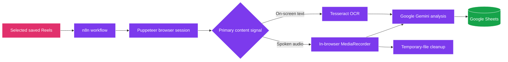

<p align="center">
  
</p>

<p align="center">
  <a href="https://n8n.io/"></a>
  <a href="https://www.docker.com/"></a>
  <a href="https://pptr.dev/"></a>
  <a href="https://ai.google.dev/"></a>
</p>

<p align="center">
  <strong>A containerised workflow that converts saved Instagram Reels into structured, AI-generated notes in Google Sheets.</strong>
</p>

<p align="center">
  <a href="#overview">Overview</a>
  ·
  <a href="#workflow">Workflow</a>
  ·
  <a href="#quick-start">Quick start</a>
  ·
  <a href="#project-structure">Project structure</a>
  ·
  <a href="#contributing">Contributing</a>
</p>

---

## Overview

**Instagram Reels AI Pipeline** is a practical knowledge-capture system for people who save great ideas but do not want those ideas to disappear into an endless feed. It processes selected saved Reels, identifies the most useful content signal—either on-screen copy or spoken audio—and sends that material to Google Gemini for a concise summary. The final result is appended to a Google Sheet, producing a personal, searchable library of ideas.

> From a saved Reel to a structured insight—without manual note-taking.

<p align="center">
  
  <br />
  <sub>Replace <code>hero-image.png</code> with a screenshot of your n8n workflow for the strongest repository preview.</sub>
</p>

| Input | Intelligent processing | Output |
| :-- | :-- | :-- |
| Saved Instagram Reels | Browser capture, OCR or audio extraction, and AI summarisation | A clean Google Sheets knowledge base |

## Why This Project

Saved Reels often contain recipes, tutorials, prompts, product ideas, creative references, and short lessons. Finding a specific insight again can be difficult. This pipeline makes saved content easier to revisit by turning it into structured, useful notes instead of leaving it buried in a feed.

| Benefit | What it means in practice |
| :-- | :-- |
| **Less manual work** | The pipeline handles capture, extraction, analysis, and storage as a connected workflow. |
| **Adaptive extraction** | It uses OCR when meaningful on-screen text is available and audio capture when speech is the stronger signal. |
| **Searchable knowledge** | Each processed Reel is recorded with its URL, date, caption, and AI-generated summary. |
| **Self-contained deployment** | Docker packages the runtime environment so the workflow is easier to set up and reproduce. |

## Workflow



### The pipeline, step by step

| Stage | Component | What happens |
| :-- | :-- | :-- |
| **01 — Capture** | Puppeteer | Opens the relevant Reels in a controlled browser session and collects the available source material. |
| **02 — Extract** | Tesseract OCR or MediaRecorder | Detects and reads on-screen copy; when text is not meaningful, it records the browser’s audio output for analysis. |
| **03 — Understand** | Google Gemini | Converts the extracted content into a clear, useful summary. |
| **04 — Organise** | Google Sheets | Adds the Reel URL, date, caption, and generated insight to a structured spreadsheet. |
| **05 — Clean up** | File management | Removes temporary audio artefacts after processing to keep storage tidy. |

## Engineering Highlights

| Capability | Design approach |
| :-- | :-- |
| **Audio-first fallback** | Rather than relying on fragmented video downloads, the workflow captures audio directly inside the browser when audio is needed. |
| **Focused OCR** | Image regions are trimmed before OCR so interface overlays do not overwhelm the extracted text. |
| **Deliberate pacing** | Processing is intentionally limited to a small batch of Reels per run, helping keep each run predictable and easy to review. |
| **Session-awareness** | If a sign-in screen interrupts the workflow, processing stops safely and an alert can be sent for manual review. |
| **Reproducible runtime** | Docker combines n8n, FFmpeg, Tesseract, and the supporting dependencies in one portable environment. |

## Quick Start

### Prerequisites

Before you begin, install and start [Docker Desktop](https://www.docker.com/products/docker-desktop/). You will also need access to the services used by the workflow, including an Instagram session, Google Gemini, and Google Sheets.

### Windows

Run the included installer script from the project directory:

```cmd
setup.bat
```

### macOS and Linux

Make the installer executable, then run it:

```bash
chmod +x setup.sh && ./setup.sh
```

### Configure the workflow

After the local environment is running, import `Workflow.json` into n8n. Then configure the required service credentials and destination Google Sheet within your n8n instance. Once set up, run a small test batch first and confirm that the resulting rows contain the expected Reel details and summaries.

> **Responsible use:** Process only content and accounts that you are authorised to access. Keep your use of this project aligned with applicable platform terms, privacy expectations, and local law.

## Project Structure

```text
Instagram-reels-ai-pipeline/
├── scripts/
│   ├── audio_cache/        # Temporary storage for captured audio
│   └── scrape_reels.js     # Core Puppeteer browser logic
├── docker-compose.yml      # Local container orchestration
├── Dockerfile              # Custom n8n image with FFmpeg and Tesseract
├── setup.bat               # Windows setup script
├── setup.sh                # macOS/Linux setup script
├── Workflow.json           # Exported n8n workflow
└── README.md               # Project documentation
```

## Built With

| Technology | Role in the pipeline |
| :-- | :-- |
| [n8n](https://n8n.io/) | Coordinates workflow steps, conditions, notifications, and integrations. |
| [Docker](https://www.docker.com/) | Provides a consistent local runtime for the pipeline. |
| [Puppeteer](https://pptr.dev/) | Powers the automated browser session and media capture workflow. |
| [Tesseract OCR](https://tesseract-ocr.github.io/) | Extracts readable text from Reel frames. |
| [Google Gemini](https://ai.google.dev/) | Produces concise summaries from extracted text or audio. |
| [Google Sheets](https://www.google.com/sheets/about/) | Stores the processed Reels as a simple, searchable knowledge base. |

## Contributing

Contributions, refinements, and new ideas are welcome. If you want to improve the workflow, please open an issue first to discuss the change, then submit a focused pull request.

```bash
# 1. Fork the repository on GitHub
# 2. Clone your fork
# 3. Create a dedicated branch
git checkout -b feature/your-improvement

# 4. Make and test your changes
# 5. Commit with a clear message
git commit -m "feat: describe your improvement"

# 6. Push and open a pull request
git push origin feature/your-improvement
```

## License

Distributed under the **MIT License**. See `LICENSE` for more information.

---

<p align="center">
  <strong>Build a library from the ideas you save.</strong><br />
  <sub>If this project helps you, consider giving the repository a star.</sub>
</p>

<p align="center">
  
</p>
